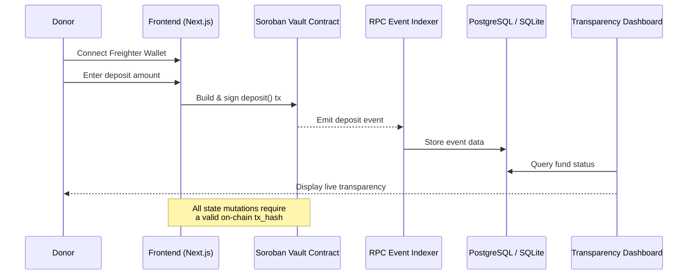

> **Part of the StellarAid stack:** [Frontend](https://github.com/Stellar-Aid/Stellar-Aid-Frontend) | [Backend](https://github.com/Stellar-Aid/Stellar-Aid-Backend) | [Contracts](https://github.com/Stellar-Aid/Stellar-Aid-contracts)

# StellarAid Frontend


**Modern, accessible interface for transparent fund disbursement on the Stellar blockchain.**

StellarAid Frontend is a Next.js 14 App Router application that provides the user-facing layer for the StellarAid milestone-based grant platform. It connects donors, project owners, and the public through three core views — deposit panel, milestone builder, and transparency dashboard — all backed by on-chain Soroban vault contracts.

---

## Overview

- **Donor Landing & Deposit Panel** — Connect your Freighter wallet and fund the vault in a single click. Contributions are held securely until milestones are met.
- **Project Creation Wizard** — A guided 4-step form to define milestones, set funding goals, and submit on-chain transactions.
- **Transparency Dashboard** — Real-time fund tracking, milestone timeline, recent deposits table, and donor leaderboard. Every transaction links directly to Stellar Expert.
- **Wallet Integration** — Reusable `useStellarWallet` hook with Freighter auto-detection, session persistence, network mismatch warnings, and version-resilient API handling.

---

## Architecture



---

## Features

| Feature | Description |
|---------|-------------|
| **Freighter Wallet Hook** | `useStellarWallet()` — detects extension, manages connection, signs transactions, handles network mismatch |
| **On-chain First** | The frontend never submits state modifications to the backend without a verified `blockchain_tx_hash` |
| **Multi-step Wizard** | 4-step project creation with per-step validation, Stellar address format checking, and dynamic milestone management |
| **Transparency Charts** | Recharts-powered bar + pie charts for fund flow and milestone status distribution |
| **Milestone Timeline** | Vertical stepper with status badges, approval counts, and recipient addresses |
| **Donor Leaderboard** | Aggregated top contributors by total deposit amount |
| **Auto-refresh** | Optional 30-second polling for real-time dashboard updates |
| **Accessible UI** | Built on Radix UI primitives via Shadcn for keyboard navigation and screen reader support |

---

## Tech Stack

| Layer | Technology |
|-------|-----------|
| Framework | Next.js 14 (App Router) |
| Language | TypeScript (strict mode) |
| Styling | Tailwind CSS 3.4 + CSS variables for theming |
| Components | Shadcn UI (Radix UI primitives) |
| Charts | Recharts |
| Icons | Lucide React |
| Wallet | Freighter API (feature-detected, version-resilient) |
| Blockchain SDK | @stellar/stellar-sdk 12.x |
| Utilities | class-variance-authority, clsx, tailwind-merge |

---

## Stellar Ecosystem & Open Source Impact

### How It Expands Stellar's Utility

StellarAid proves that Stellar and Soroban can power **real-world social impact applications** beyond simple payments. By implementing milestone-gated, multi-signature fund disbursement entirely on-chain, it:

- Demonstrates Soroban's capacity for complex, stateful smart contract workflows
- Solves the **transparency bottleneck** in global philanthropy — every deposit, release, and refund is auditable on-chain
- Provides a reference implementation for grant flow DeFi primitives that other Stellar projects can adopt and extend

### How It Onboards New Contributors

The frontend codebase is explicitly modularized to lower the barrier for new open-source contributors:

- **Component isolation** — Each UI component (DepositPanel, MilestoneForm, TransparencyChart) is self-contained with clear props interfaces. Contributors can modify or extend individual components without understanding the entire app.
- **Hook abstraction** — The `useStellarWallet` hook abstracts all wallet complexity. Contributors can build new features (e.g., a refund panel, NFT minting) by simply consuming the hook.
- **API client layer** — The typed `api.ts` client provides a clean separation between UI and backend. New API integrations require only adding a new typed method.
- **Chart extensibility** — Adding new visualization modules (e.g., time-series area charts, geographic fund distribution) requires only creating a new Recharts component and feeding it data.
- **Labeled issue backlog** — Issues are categorized by difficulty (`wave-trivial`, `wave-medium`, `wave-high`) and module area, making it easy for contributors of all skill levels to find work.

---

## Getting Started

### Prerequisites

- **Node.js** 18+ and npm
- **Freighter Wallet** browser extension ([freighter.app](https://www.freighter.app/))
- **StellarAid Backend** running locally (for API data)
- **StellarAid Contracts** deployed to Testnet (for on-chain transactions)

### Installation

```bash
# Clone the repository
git clone https://github.com/Stellar-Aid/Stellar-Aid-Frontend.git
cd Stellar-Aid-Frontend

# Install dependencies
npm install

# Configure environment
cp .env.example .env.local
# Edit .env.local with your contract ID and API URL

# Start development server
npm run dev
```

The app will be available at [http://localhost:3000](http://localhost:3000).

### Environment Variables

| Variable | Description | Default |
|----------|-------------|---------|
| `NEXT_PUBLIC_STELLAR_NETWORK` | `testnet` or `mainnet` | `testnet` |
| `NEXT_PUBLIC_SOROBAN_RPC_URL` | Soroban RPC endpoint | `https://soroban-testnet.stellar.org` |
| `NEXT_PUBLIC_API_URL` | Backend API base URL | `http://localhost:4000` |
| `NEXT_PUBLIC_VAULT_CONTRACT_ID` | Deployed vault contract ID | — |

---

## Project Structure

```
src/
├── app/
│   ├── layout.tsx          # Root layout with WalletProvider + navigation
│   ├── page.tsx            # Donor landing page with deposit panel
│   ├── create/page.tsx     # Multi-step milestone builder wizard
│   ├── dashboard/page.tsx  # Transparency dashboard with charts
│   └── globals.css         # Tailwind base + theme variables
├── components/
│   ├── ui/                 # Shadcn base components (Button, Card, Badge, etc.)
│   ├── ConnectWalletButton.tsx  → WalletButton.tsx
│   ├── DepositPanel.tsx    # Donor deposit flow
│   ├── MilestoneForm.tsx   # Multi-step milestone proposal
│   ├── TransparencyChart.tsx  # Recharts fund flow + status charts
│   └── WalletProvider.tsx  # React context for shared wallet state
├── hooks/
│   └── useStellarWallet.ts # Reusable Freighter wallet hook
└── lib/
    ├── api.ts              # Typed backend API client
    ├── stellar.ts          # Soroban contract invocation builders
    └── utils.ts            # cn() utility
```

---

## Security

- **On-chain first**: The frontend NEVER submits state modifications to the backend API without a valid `blockchain_tx_hash`. This is enforced both at the API client level (`api.createMilestone` throws if `tx_hash` is empty) and in the form submission flow.
- **Wallet network validation**: The `useStellarWallet` hook detects network mismatches between the connected wallet and the configured network.
- **No URL token leaks**: Authentication tokens are stored in `localStorage` and attached via `Authorization` headers — never in query parameters.
- **CODEOWNERS**: All source code changes require review from `@Trovic1`.

---

## License

MIT — see [LICENSE](./LICENSE) for details.
